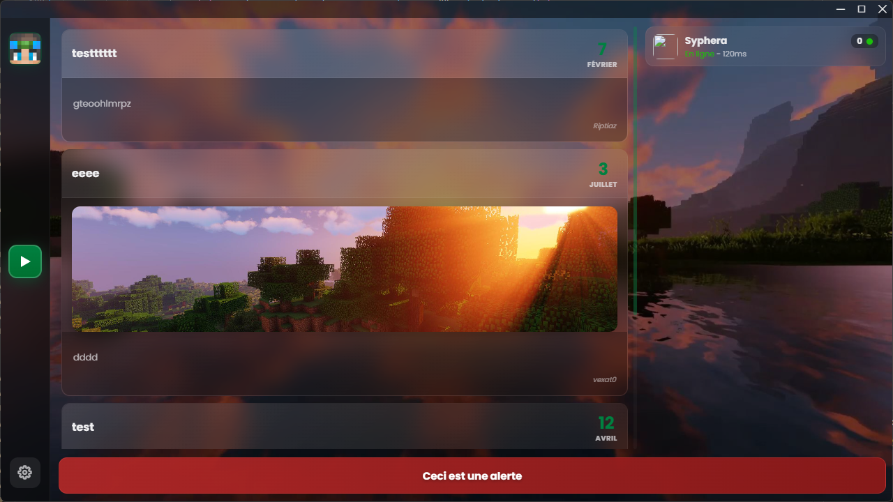
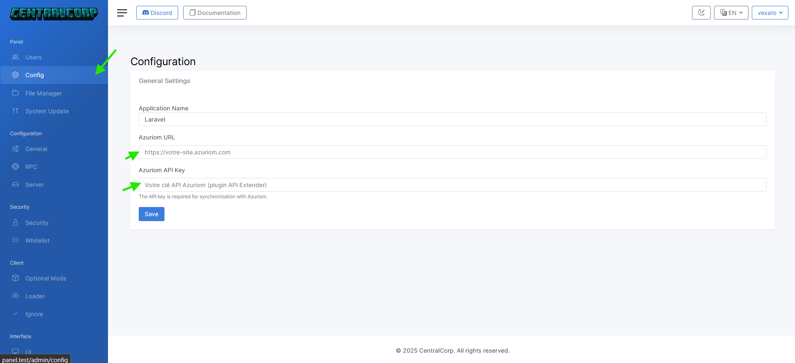
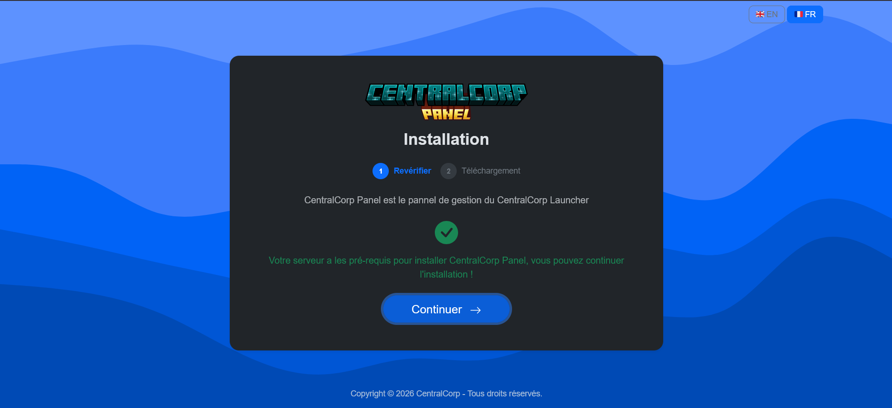

<p align="center">
  
</p>

# CentralCorp Website and Documentation

This repository contains the official CentralCorp website and the French and English documentation for the CentralCorp Minecraft launcher ecosystem. It combines product pages with practical guides for the launcher, self-hosted web panel and installer.

[](https://github.com/CentralCorp/centralcorp.github.io/actions/workflows/deploy.yml)
[](https://centralcorp.github.io/)
[](https://vitepress.dev/)

**[Open the website](https://centralcorp.github.io/)** · **[Minecraft Launcher Panel](https://centralcorp.github.io/en/minecraft-launcher-panel)** · **[Installation](https://centralcorp.github.io/en/install/prerequis)** · **[Preview](https://centralcorp.github.io/en/preview)**

## CentralCorp at a glance

| Minecraft launcher | Web panel | Installer |
| --- | --- | --- |
|  |  |  |

## Documentation scope

- understand how the Minecraft Launcher Panel, launcher and installer work together;
- prepare a development environment and compatible web hosting;
- configure the launcher repository and its Azuriom or standalone panel environment;
- install and configure the CentralCorp web panel;
- manage launcher files and optional mods;
- build Windows, Linux and macOS launcher packages.

The launcher is designed for Azuriom authentication and offline-mode Minecraft servers. It does not support Microsoft online-mode servers.

## Main pages

- [French product homepage](https://centralcorp.github.io/fr/)
- [Minecraft Launcher Panel guide](https://centralcorp.github.io/fr/minecraft-launcher-panel)
- [English Minecraft Launcher Panel guide](https://centralcorp.github.io/en/minecraft-launcher-panel)
- [Installation prerequisites](https://centralcorp.github.io/fr/install/prerequis)
- [Launcher preview](https://centralcorp.github.io/fr/preview)

## Local development

The site uses [VitePress](https://vitepress.dev/) with French and English locales.

```bash
npm install
npm run docs:dev
```

Build the production site with:

```bash
npm run docs:build
```

The VitePress configuration generates the sitemap, canonical URLs, social metadata and language alternates. Static public assets, including `robots.txt`, live in `public/`.

## CentralCorp ecosystem

- [Documentation and website](https://github.com/CentralCorp/centralcorp.github.io) — this product site and its guides
- [CentralCorp Launcher](https://github.com/CentralCorp/CentralCorp-Launcher) — customizable player application
- [CentralCorp Panel](https://github.com/CentralCorp/centralpanel-v2) — self-hosted Minecraft Launcher Panel
- [CentralCorp Installer](https://github.com/CentralCorp/Installer) — hosting checks and panel deployment

Each repository has its own license. This documentation repository currently does not include a license file; no reuse permission should be inferred from the licenses of the other components.
