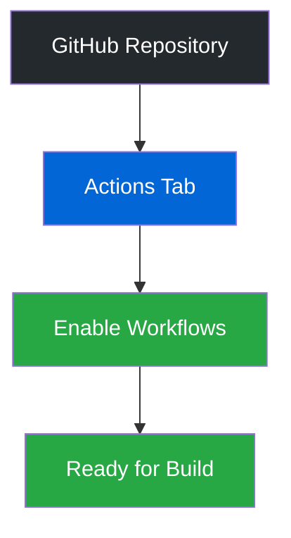

# Step 5: Compilation and Distribution 🎉

!!! info "Objective"
    In this final step, we will compile your launcher for distribution and deploy it on GitHub.

## 📋 Preparation Checklist

Before starting, make sure that:

- [ ] All your modifications are complete
- [ ] Your version in `package.json` is unique and up to date
- [ ] You have access to your GitHub repository

## 🚀 Deployment on GitHub

### 1. Workflow Configuration

1. Go to your GitHub repository
2. Access the "Actions" tab
3. Enable the proposed workflows

### 2. Publication Process

1. Open GitHub Desktop
2. Create a new commit with a descriptive message (e.g., "Update v1.0.1")
3. Click on "Commit"
4. Push your changes with "Push to origin"

### 3. File Retrieval

| Operating System | File Format | Description | Download Link |
|-----------------|-------------|-------------|---------------|
| Windows | `.exe` | Windows Installer | [Download](https://github.com/Riptiaz/CentralCorp-Launcher/releases/latest/download/CentralCorp-Launcher-Setup.exe) |
| Linux | `.deb` | Debian Package | [Download](https://github.com/Riptiaz/CentralCorp-Launcher/releases/latest/download/CentralCorp-Launcher.deb) |
| Linux | `.AppImage` | Portable Linux Application | [Download](https://github.com/Riptiaz/CentralCorp-Launcher/releases/latest/download/CentralCorp-Launcher.AppImage) |
| macOS | `.dmg` | macOS Disk Image | [Download](https://github.com/Riptiaz/CentralCorp-Launcher/releases/latest/download/CentralCorp-Launcher.dmg) |

## 🆘 Support

If you encounter any difficulties:

!!! warning "Troubleshooting Steps"
    - Consult the complete documentation
    - Join our Discord server for assistance
    - Check the compilation logs in the GitHub "Actions" tab

!!! tip "Pro Tip"
    Regularly check the compilation logs in the GitHub "Actions" tab to quickly identify any potential issues.

!!! success "Congratulations! 🎉"
    Your launcher is now ready for distribution. Thank you for following this guide!

---

-   :fontawesome-solid-book: __Documentation__

    ---

    Need more help? Check our [full documentation](https://docs.centralcorp.fr)

-   :fontawesome-brands-discord: __Discord Support__

    ---

    Join our [Discord server](https://discord.gg/VCmNXHvf77) for real-time assistance

*For any additional questions, feel free to contact us on our Discord server.* 