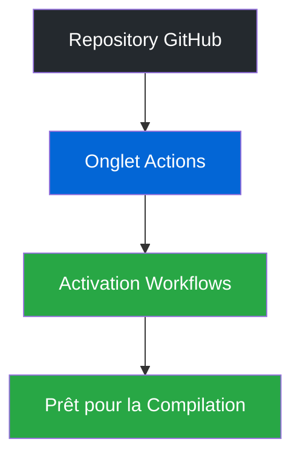

# Étape 5 : Compilation et Distribution 🎉

!!! info "Objectif"
    Dans cette étape finale, nous allons compiler votre launcher pour la distribution et le déployer sur GitHub.

## 📋 Liste de Préparation

Avant de commencer, assurez-vous que :

- Toutes vos modifications sont terminées
- Votre version dans `package.json` est unique et à jour
- Vous avez accès à votre repository GitHub

## 🚀 Déploiement sur GitHub

### 1. Configuration des Workflows

1. Rendez-vous sur votre repository GitHub
2. Accédez à l'onglet "Actions"
3. Activez les workflows proposés

### 2. Processus de Publication

1. Ouvrez GitHub Desktop
2. Créez un nouveau commit avec un message descriptif (ex: "Mise à jour v1.0.1")
3. Cliquez sur "Commit"
4. Poussez vos modifications avec "Push to origin"

### 3. Récupération des Fichiers

| Système d'exploitation | Format de fichier | Description |
|----------------------|------------------|-------------|
| Windows | `.exe` | Installateur Windows |
| Linux | `.deb` | Package Debian |
| Linux | `.AppImage` | Application portable Linux |
| macOS | `.dmg` | Image disque macOS | 

## 🆘 Support

En cas de difficultés :

!!! warning "Étapes de Dépannage"
    - Consultez la documentation complète
    - Rejoignez notre serveur Discord pour obtenir de l'aide
    - Vérifiez les logs de compilation dans l'onglet "Actions" de GitHub

!!! tip "Conseil Pro"
    Vérifiez régulièrement les logs de compilation dans l'onglet "Actions" de GitHub pour identifier rapidement tout problème potentiel.

!!! success "Félicitations ! 🎉"
    Votre launcher est maintenant prêt à être distribué. Merci d'avoir suivi ce guide !

---

-   :fontawesome-solid-book: __Documentation__

    ---

    Besoin d'aide ? Consultez notre [documentation complète](https://docs.centralcorp.fr)

-   :fontawesome-brands-discord: __Support Discord__

    ---

    Rejoignez notre [serveur Discord](https://discord.gg/Bnpw2awVRV) pour une assistance en temps réel

*Pour toute question supplémentaire, n'hésitez pas à nous contacter sur notre serveur Discord.* 